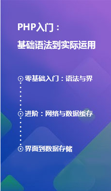
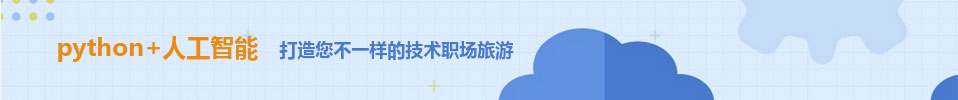

# HTML+CSS作品展示（学成在线网）
> ###  参考来源：[黑马程序员pink老师前端入门教程，零基础必看的h5(html5)+css3+移动端前端视频教程_哔哩哔哩_bilibili](https://www.bilibili.com/video/BV14J4114768?p=218)

# 总结：

1. 命名方面：命名时注意不要重复，如果重复了也要在CSS样式中写上对应的选择器，防止因同名而使前面设置的样式影响到后面的；
2. 消除按钮边框：可以在CSS中设置 **border:0;** 使得消除按钮的边框；
3. 消除最右边 **div** 的右边距：设置最右边 **div** 的右边距为0，同时还需要注意选择器的权重；
4. 快捷键方面：按住鼠标滚轮选中多行进行编辑，或者按Alt+Shift+鼠标左键选中多行进行编辑；
5. 导航栏方面：实际开发中不会直接用 **a ,**而是用 **li+a** 的做法（语义更清晰；避免网站被搜索引擎认为有堆砌关键字嫌疑从而使网站降权，影响网站排名）。

# 网页截图如下：


# 网页GitHub地址如下：

[学成在线](https://jiang-lijun.github.io/front-end/)

# 代码如下：

### HTML：

```html
<!DOCTYPE html>
<html lang="en">
<head>
    <meta charset="UTF-8">
    <meta http-equiv="X-UA-Compatible" content="IE=edge">
    <meta name="viewport" content="width=device-width, initial-scale=1.0">
    <title>学成在线</title>
    <link rel="stylesheet" href="style.css">
</head>
<body>
    <!-- header start -->
    <div class="header w">
        <div class="logo"></div>
        <div class="nav">
            <ul>
                <li><a href="#">首页</a></li>
                <li><a href="#">课程</a></li>
                <li><a href="#">职业规划</a></li>
            </ul>
        </div>
        <div class="search">
            <input type="text" value="请输入关键词" class="input">
            <input type="button" value="" class="btn">
        </div>
        <div class="usr">
            
            <div class="name">qq-lilei</div>
        </div>
    </div>
    <!-- header end -->

    <!-- banner start -->
    <div class="banner">
        <div class="w">
            <div class="subnav">
                <ul>
                    <li><a href="#">前端开发<span>&gt;</span></a></li>
                    <li><a href="#">后端开发<span>&gt;</span></a></li>
                    <li><a href="#">移动开发<span>&gt;</span></a></li>
                    <li><a href="#">人工智能<span>&gt;</span></a></li>
                    <li><a href="#">商业预测<span>&gt;</span></a></li>
                    <li><a href="#">云计算&大数据<span>&gt;</span></a></li>
                    <li><a href="#">运维&测试<span>&gt;</span></a></li>
                    <li><a href="#">UI设计<span>&gt;</span></a></li>
                    <li><a href="#">产品<span>&gt;</span></a></li>
                </ul>
            </div>
            <div class="course">
                <h4>我的课程表</h4>
                <div class="info">
                    <ul>
                        <li>
                            <span class="info1">继续学习 程序语言设计</span>
                            <span class="info2">正在学习-使用对象</span>
                        </li>
                        <li>
                            <span class="info1">继续学习 程序语言设计</span>
                            <span class="info2">正在学习-使用对象</span>
                        </li>
                        <li>
                            <span class="info1">继续学习 程序语言设计</span>
                            <span class="info2">正在学习-使用对象</span>
                        </li>
                    </ul>
                    <a href="#">全部课程</a>
                </div>
            </div>
        </div>
    </div>
    <!-- banner end -->

    <!-- goods start -->
    <div class="goods w">
        <h3>精品推荐</h3>
        <ul>
            <li><a href="#">JQuery</a></li>
            <li><a href="#">Spark</a></li>
            <li><a href="#">MySQL</a></li>
            <li><a href="#">JavaWeb</a></li>
            <li><a href="#">Oracle</a></li>
            <li><a href="#">Java</a></li>
        </ul>
        <div class="mod">修改兴趣</div>
    </div>
    <!-- goods end -->

    <!-- box start -->
    <div class="box w">
        <div class="hd">
            <h2>精品推荐</h2>
            <a href="#">查看全部</a>
        </div>
        <div class="bd">
            <ul>
                <li><a href="#">
                    
                    <h3>Think PHP 5.0 博客系统实战项目演练</h3>
                    <p><span>高级</span>  •  1125人在学习</p>
                </a></li>
                <li><a href="#">
                    
                    <h3>Android 网络图片加载框架详解</h3>
                    <p><span>高级</span>  •  1125人在学习</p>
                </a></li>
                <li><a href="#">
                    
                    <h3>Angular 2 最新框架+主流技术+项目实战</h3>
                    <p><span>高级</span>  •  1125人在学习</p>
                </a></li>
                <li><a href="#">
                    
                    <h3>Android Hybrid APP开发实战 H5+原生！</h3>
                    <p><span>高级</span>  •  1125人在学习</p>
                </a></li>
                <li><a href="#">
                    
                    <h3>Android Hybrid APP开发实战 H5+原生！</h3>
                    <p><span>高级</span>  •  1125人在学习</p>
                </a></li>
                <li><a href="#">
                    
                    <h3>Think PHP 5.0 博客系统实战项目演练</h3>
                    <p><span>高级</span>  •  1125人在学习</p>
                </a></li>
                <li><a href="#">
                    
                    <h3>Android 网络图片加载框架详解</h3>
                    <p><span>高级</span>  •  1125人在学习</p>
                </a></li>
                <li><a href="#">
                    
                    <h3>Angular 2 最新框架+主流技术+项目实战</h3>
                    <p><span>高级</span>  •  1125人在学习</p>
                </a></li>
                <li><a href="#">
                    
                    <h3>Android Hybrid APP开发实战 H5+原生！</h3>
                    <p><span>高级</span>  •  1125人在学习</p>
                </a></li>
                <li><a href="#">
                    
                    <h3>Android Hybrid APP开发实战 H5+原生！</h3>
                    <p><span>高级</span>  •  1125人在学习</p>
                </a></li>
            </ul>
        </div>
    </div>
    <!-- box end -->

    <!-- leftnav sart  -->
    <!-- <div class="leftnav">
        <ul>
            <li><a href="">编程入门</a></li>
            <li><a href="">数据分析师</a></li>
            <li><a href="">机器学习工程师</a></li>
            <li><a href="">前端开发工程师</a></li>
            <li><a href="">人工智能工程师</a></li>
            <li><a href="">全栈工程师</a></li>
            <li><a href="">iOS工程师</a></li>
            <li><a href="">VR开发者</a></li>
            <li><a href="">深度学习</a></li>
            <li><a href="">商业预测分析师</a></li>
            <li><a href="">Android开发工程师</a></li>
        </ul>
    </div> -->
    <!-- leftnav end -->

    <!-- rumen start  -->
    <div class="rumen w">
        <div class="hd w">
            <h2>编程入门</h2>
            <div class="topnav">
                <ul>
                    <li ><a href="" class="first">热门</a></li>
                    <li><a href="">初级</a></li>
                    <li><a href="">中级</a></li>
                    <li><a href="">高级</a></li>
                </ul>
            </div>
            <a href="#" class="chakanquanbu">查看全部</a>
        </div>
        <div class="box2">
            <div class="left">
                
            </div>
            <div class="right">
                <div class="top">
                    
                </div>
                <div class="under">
                    <ul>
                        <li><a href="#">
                            
                            <h3>Android Hybrid APP开发实战 H5+原生！</h3>
                            <p><span>高级</span>  •  1125人在学习</p>
                        </a></li>
                        <li><a href="#">
                            
                            <h3>Android Hybrid APP开发实战 H5+原生！</h3>
                            <p><span>高级</span>  •  1125人在学习</p>
                        </a></li>
                        <li><a href="#">
                            
                            <h3>Android Hybrid APP开发实战 H5+原生！</h3>
                            <p><span>高级</span>  •  1125人在学习</p>
                        </a></li>
                        <li><a href="#">
                            
                            <h3>Android Hybrid APP开发实战 H5+原生！</h3>
                            <p><span>高级</span>  •  1125人在学习</p>
                        </a></li>
                    </ul>
                </div>
            </div>
        </div>
    </div>
    <!-- rumen end -->

    <!-- fen start  -->
    <div class="fenxi w">
        <div class="hd w">
            <h2>数据分析师</h2>
            <div class="topnav">
                <ul>
                    <li ><a href="" class="first">热门</a></li>
                    <li><a href="">初级</a></li>
                    <li><a href="">中级</a></li>
                    <li><a href="">高级</a></li>
                </ul>
            </div>
            <a href="#" class="chakanquanbu">查看全部</a>
        </div>
        <div class="box2">
            <div class="left">
                
            </div>
            <div class="right">
                <div class="top">
                    
                </div>
                <div class="under">
                    <ul>
                        <li><a href="#">
                            
                            <h3>Android Hybrid APP开发实战 H5+原生！</h3>
                            <p><span>高级</span>  •  1125人在学习</p>
                        </a></li>
                        <li><a href="#">
                            
                            <h3>Android Hybrid APP开发实战 H5+原生！</h3>
                            <p><span>高级</span>  •  1125人在学习</p>
                        </a></li>
                        <li><a href="#">
                            
                            <h3>Android Hybrid APP开发实战 H5+原生！</h3>
                            <p><span>高级</span>  •  1125人在学习</p>
                        </a></li>
                        <li><a href="#">
                            
                            <h3>Android Hybrid APP开发实战 H5+原生！</h3>
                            <p><span>高级</span>  •  1125人在学习</p>
                        </a></li>
                    </ul>
                </div>
            </div>
        </div>
    </div>
    <!-- fenxi end -->

    <!-- footer start  -->
    <div class="footer">
        <div class="box w">
            <div class="left">
                
                <p>学成在线致力于普及中国最好的教育它与中国一流大学和机构合作提供在线课程。<br />
                    © 2017年XTCG Inc.保留所有权利。-沪ICP备15025210号</p>
                <div class="app">下载APP</div>
            </div>
        <dl>
            <dt>关于学成网</dt>
            <dd>关于</dd>
            <dd>管理团队</dd>
            <dd>工作机会</dd>
            <dd>客户服务</dd>
            <dd>帮助</dd>
        </dl>
        <dl>
            <dt>新手指南</dt>
            <dd>如何注册</dd>
            <dd>如何选课</dd>
            <dd>如何拿到毕业证</dd>
            <dd>学分是什么</dd>
            <dd>考试未通过怎么办</dd>
        </dl>
        <dl>
            <dt>合作伙伴</dt>
            <dd>合作机构</dd>
            <dd>合作导师</dd>
        </dl>
        </div>
    </div>
    <!-- footer end -->
</body>
</html>
```


### CSS：

```css
* {
    margin: 0;
    padding: 0;
}
body {
    background-color: #f3f5f7;
}
.w {
    width: 1200px;
    margin: auto;
}
li {
    list-style: none;
}
a {
    text-decoration: none;
}
.header {
    height: 42px;
    margin: 30px auto;/* 此处会层叠.w里的margin */
}
.logo {
    float: left;
    width: 198px;
    height: 42px;
}
.nav {
    float: left;
    margin-left:60px;
}
.nav ul li {
    float: left;
    margin: 0 15px;
}
.nav ul li a {
    display: block;
    height: 42px;
    padding: 0 10px;
    color: rgb(5,5,5);
    font-size: 18px;
    line-height: 42px;
}
.nav ul li a:hover {
    color: rgb(0,164,255);
    border-bottom: 2px solid rgb(0,164,255);
}
.search {
    float: left;
    width: 412px;
    height: 42px;
    background-color: yellow;
    margin-left: 70px;
}
.search .input {
    float: left;
    width: 345px;
    height: 40px;
    padding-left: 15px;
    color: #cececf;
    border: 1px solid rgb(0,164,255);
    border-right: 0;
}
.search .btn {
    float: left;
    width: 50px;
    height: 42px;
    background: url(images/btn.png);
    border: 0;
}
.usr {
    float: right;
    padding-right: 35px;
}
.usr img {
    float: left;
}
.usr .name {
    float: left;
    font-size: 14px;
    color: #666;
    line-height: 42px;
}
.banner {
    height: 422px;
    background-color: #1c036c;
}
.banner .w {
    height: 422px;
    background: url(images/banner.png) no-repeat top center;
}
.subnav {
    float: left;
    width: 192px;
    height: 422px;
    background: rgba(0,0,0,.3);
}
.subnav li {
    padding: 0 20px;
    height: 45px;
    line-height: 45px;
}
.subnav a {
    font-size: 14px;
    color: #fff;
}
.subnav a:hover {
    color: rgb(0,164,255);
}
.subnav span {
    float: right;
}
.course {
    float: right;
    margin-top: 50px;
    width: 230px;
    height: 300px;
}
.course h4 {
    height: 49px;
    padding: 0 65px;
    line-height: 49px;
    font-size: 18px;
    color: #fff;
    font-weight: 700;
    background-color: #9bceea;
}
.info {
    height: 253px;
    padding: 0 20px;
    background-color: #fff;
}

.info li {
    padding: 15px 0;
    border-bottom: 1px solid #a5a5a5;
}
.info1 {
    display: block;
    font-size: 16px;
    color: #4e4e4e;
    font-weight: 700;
}
.info2 {
    display: block;
    font-size: 12px;
    color: #a5a5a5;
}
.info a {
    display: block;
    height: 38px;
    margin-top: 5px;
    border: 1px solid rgb(0,164,255);
    line-height: 38px;
    text-align: center;
    font-weight: 700;
    font-size: 16px;
    color: rgb(0,164,255);
}
.goods {
    height: 60px;
    margin-top: 10px;
    line-height: 60px;
    background-color: #fff;
    box-shadow: 0 2px 3px 3px rgba(0, 0, 0, 0.1);
}
.goods h3 {
    display: block;
    margin: 0 30px 0 30px;
    float: left;
    font-size: 16px;
    color: #00a4ff;
}
.goods li {
    float: left;
}
.goods li a {
    padding: 0 35px;
    font-size: 16px;
    color: rgb(0, 0, 0);
    border-left: 1px solid #ccc;
}
.mod {
    float: right;
    padding-right: 35px;
    font-size: 14px;
    color: #00a4ff;
}
.box {
    margin-top: 35px;
    height: 598px;
    width: 1220px;
}
.box .hd {
    height: 42px;
}
.box .hd h2{
    float: left;
    font-size: 20px;
    color: #494949;
}
.box .hd a {
    float: right;
    margin-right: 32px; 
    font-size: 12px;
    color: #a5a5a5;
    line-height: 42px;
}
.box .bd {
    height: 557px;
}
.box .bd li {
    float: left;
    margin: 0 15px 15px 0;
    width: 229px;
    height: 271px;
    background-color: #fff;
}
.box .bd img {
    width: 100%;
}
.box .bd h3 {
    display: block;
    margin: 23px 20px 18px 16px;
    font-size: 14px;
    color: #050505;
}
.box .bd p {
    font-size: 12px;
    color: #999999;
}
.box .bd p span{
    margin-left: 23px;
    font-size: 12px;
    color: #ff7c2d;
}
/* .leftnav {
    float: left;
    margin-top: 389px;
    width: 188px;
    height: 431px;
    background-color: pink;
} */
.rumen {
    margin-top: 35px;
    height: 436px;
}
.rumen .hd {
    height: 42px;
}
.rumen .hd h2 {
    float: left;
    font-size: 20px;
    color: #494949;
}
.rumen .hd .topnav {
    float: left;
    margin-left: 347px;
    height: 42px;
    line-height: 42px;
}
.rumen .hd .topnav li{
    float: left;
    margin-right: 70px;
}
.rumen .hd .topnav a {
    font-size: 16px;
    color: #868686;
}
.rumen .hd .topnav li .first {
    color: #00a4ff;
}
.rumen .hd .chakanquanbu {
    float: right;
    margin-right: 32px; 
    font-size: 12px;
    color: #a5a5a5;
    line-height: 42px;
}
.rumen .box2 {
    height: 394px;
}
.rumen .box2 .left {
    float: left;
    width: 229px;
    height: 392px;
}
.rumen .box2 .right {
    float: left;
    width: 970px;
    height: 392px;
}
.rumen .box2 .right .top {
    float: left;
    margin-left: 15px;
    width: 958px;
    height: 100px;
}
.rumen .box2 .under {
    float: left;
    margin: 22px 0 0 0;
    width: 970px;
    height: 270px;
}
.rumen .box2 .under li {
    float: right;
    margin-left: 13px;
    width: 229px;
    height: 270px;
    background-color: #fff;
}
.rumen .box2 .under li img {
    width: 100%;
}
.fenxi {
    margin-top: 35px;
    height: 436px;
}
.fenxi .hd {
    height: 42px;
}
.fenxi .hd h2 {
    float: left;
    font-size: 20px;
    color: #494949;
}
.fenxi .hd .topnav {
    float: left;
    margin-left: 347px;
    height: 42px;
    line-height: 42px;
}
.fenxi .hd .topnav li{
    float: left;
    margin-right: 70px;
}
.fenxi .hd .topnav a {
    font-size: 16px;
    color: #868686;
}
.fenxi .hd .topnav li .first {
    color: #00a4ff;
}
.fenxi .hd .chakanquanbu {
    float: right;
    margin-right: 32px; 
    font-size: 12px;
    color: #a5a5a5;
    line-height: 42px;
}
.fenxi .box2 {
    height: 394px;
}
.fenxi .box2 .left {
    float: left;
    width: 229px;
    height: 392px;
}
.fenxi .box2 .right {
    float: left;
    width: 970px;
    height: 392px;
}
.fenxi .box2 .right .top {
    float: left;
    margin-left: 15px;
    width: 958px;
    height: 100px;
}
.fenxi .box2 .under {
    float: left;
    margin: 22px 0 0 0;
    width: 970px;
    height: 270px;
}
.fenxi .box2 .under li {
    float: right;
    margin-left: 13px;
    width: 229px;
    height: 270px;
    background-color: #fff;
}
.fenxi .box2 .under li img {
    width: 100%;
}
.footer {
    margin-top: 40px;
    height: 418px;
    background-color: #fff;
}
.footer .box {
    height: 418px;
}
.footer .left {
    float: left;
    width: 540px;
}
.footer .left img{
    margin: 34px 0 24px 20px;
}
.footer .left p {
    margin: 0 0 24px 20px;
    font-size: 12px;
    color: #666;
}
.footer .left .app {
    margin: 0 0 24px 20px;
    width: 120px;
    height: 36px;
    border: 1px solid #00a4ff;
    font-size: 16px;
    text-align: center;
    line-height: 36px;
    color: #00a4ff;
}
.footer dl {
    float: right;
    margin: 35px 0 0 125px;
    width: 94px;
}
.footer dt {
    font-size: 16px;
    color: #333;
}
.footer dd {
    font-size: 12px;
    color: #333;
}
```

